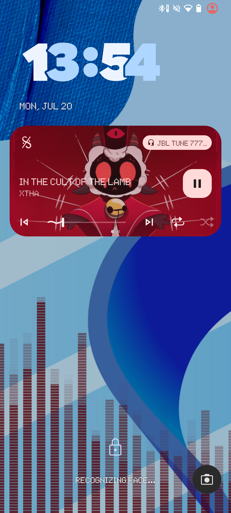
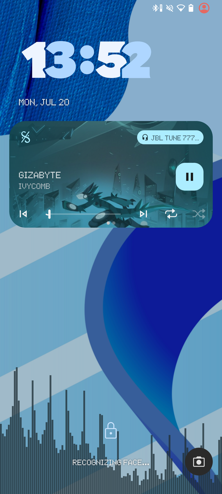

[![GitHub Release][release-shield]][release-url]
[![Issues][issues-shield]][issues-url]
[![License][license-shield]][license-url]

# PulseAutoColor

An LSPosed module that automatically changes Evolution X Pulse visualizer colors based on the currently playing album artwork.

Table of Contents

- [About](#about)
- [Requirements](#requirements)
- [How It Works](#how-it-works)
- [Downloads](#downloads)
- [Installation](#installation)
- [License](#license)

## About

PulseAutoColor is an advanced LSPosed module designed for Evolution X users who want a more dynamic and personalized experience with their Pulse visualizer. The module hooks into the system's notification media manager to detect when music changes and automatically extracts the dominant color from the album artwork, applying it to the Pulse visualizer in real-time.

This creates a seamless, visually immersive experience where your music's color palette is reflected in the system UI. Supports **LibXposed API 102** and requires root access via a compatible Xposed framework.

## Requirements

- **Evolution X** ROM
- **Android 10 (API 29)** or higher
- **LSPosed** with LibXposed API 102 or higher
- **Root access**
- **Pulse** with Color set to Custom enabled in settings

## How It Works

1. Hooks `NotificationMediaManager` inside `com.android.systemui`
2. Detects media metadata updates and album artwork changes
3. Retrieves the current album artwork from media notifications
4. Extracts the dominant color using the Android Palette API
5. Writes the color to `Settings.Secure.pulse_color_user`
6. Evolution X updates the Pulse visualizer with the new color in real time

## Downloads

Download the latest module from the GitHub Releases page:

[Latest Release](../../releases/latest)

## Installation

1. Download the latest PulseAutoColor module from the releases page.
2. Enable the module in LSPosed Manager and grant `com.android.systemui` permissions.
3. Make sure you have enabled Pulse in Evolver and set the Color option to Custom.
4. Reboot your device for the changes to take effect.

> [!NOTE]
> This module is designed for Evolution X. Compatibility with other ROMs has not been tested and is not guaranteed. Ensure LSPosed with API 102 is properly installed and Pulse visualizer is enabled in your system settings.

## License

This project is licensed under the **MIT License**.

See the [LICENSE](LICENSE) file for the full license text.

(<a href="#readme-top">back to top</a>)

[release-shield]: https://img.shields.io/github/v/release/v3ndable/PulseAutoColor.svg?style=for-the-badge
[release-url]: https://github.com/v3ndable/PulseAutoColor/releases

[issues-shield]: https://img.shields.io/github/issues/v3ndable/PulseAutoColor.svg?style=for-the-badge
[issues-url]: https://github.com/v3ndable/PulseAutoColor/issues

[license-shield]: https://img.shields.io/github/license/v3ndable/PulseAutoColor.svg?style=for-the-badge
[license-url]: https://github.com/v3ndable/PulseAutoColor/blob/main/LICENSE
